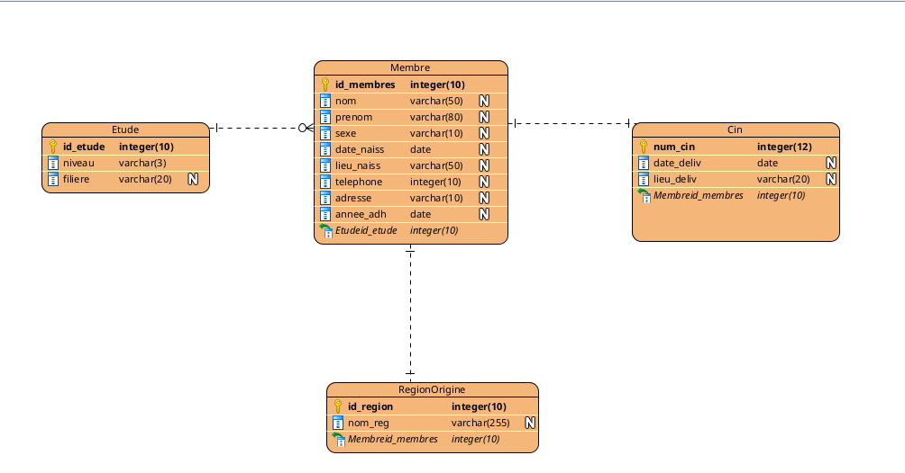

## Voici le modele conceptuelle de donnee pour notre systeme


### Description du Modèle Conceptuel de Données (MCD)
Le système repose sur une architecture centralisée autour de l'entité Membre, permettant une gestion précise des adhérents de notre association MAFAMI.

1. Entités Principales
**Membre** : Cœur du système, regroupant les informations personnelles (Nom, Prénom, Sexe, Contact) et la localisation interne (Bloc et Porte).

**Étude** : Gère le parcours académique (Niveau et Filière). Cette séparation permet de filtrer facilement les membres par promotion ou par domaine d'étude.

**Région d'Origine** : Permet de répertorier la provenance géographique des membres pour des statistiques régionales.

**CIN** : Entité liée aux informations officielles de la Carte d'Identité Nationale (Numéro, Date et Lieu de délivrance).

2. Règles de Gestion
- Un Membre possède un seul CIN et un CIN appartient à un seul membre (Relation 1:1).

- Un Membre appartient à une seule Région d'Origine et suit un cursus d'Étude spécifique.

- Le système est conçu pour assurer l'intégrité des données, notamment grâce à des clés uniques sur les identifiants et les numéros de CIN.

3. Technologies de Données
SGBD : **MySQL** .

##### Pour cette projet on a besoin d installer les middlewares pour faire connecter mysql a express 
```bash
npm install mysql express-myconnection
```

